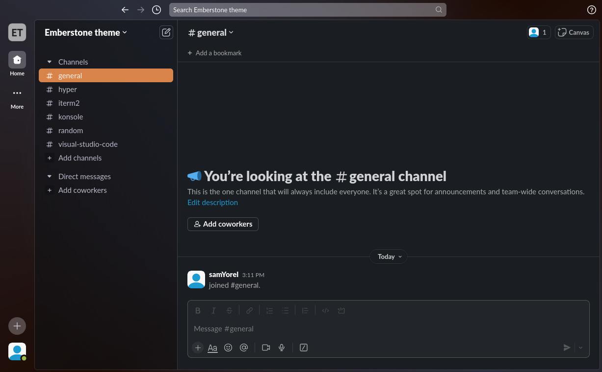

<h1 align="center">
	
    <br/>
	Emberstone for Slack
</h1>

<div align="center">
  
</div>

## Installation

1. Click your profile picture (in the bottom left)
2. Go to `Preferences` → `Themes`
3. Copy this string :

```text
#242835,#D88349,#9BBA51,#CAA53E
```

4. Paste the string into the `Import theme` field

<hr/>

<p align="center">
  Distributed under the MIT License. © 2024 <a href="https://github.com/emberstone-theme">Emberstone Theme</a>
</p>
